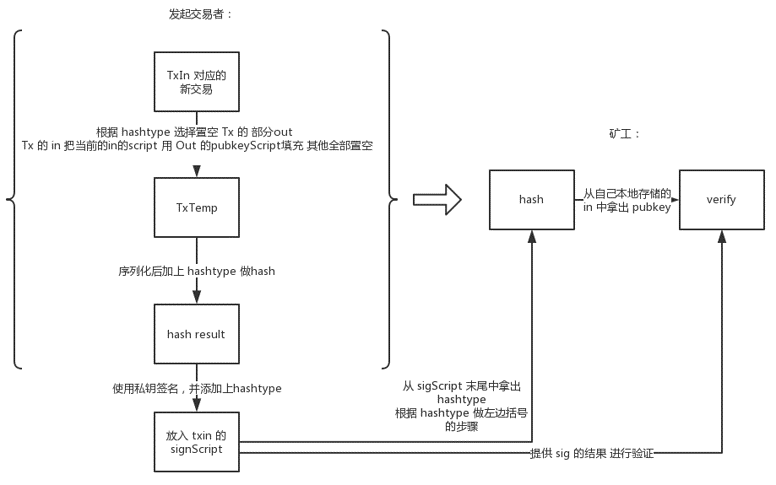
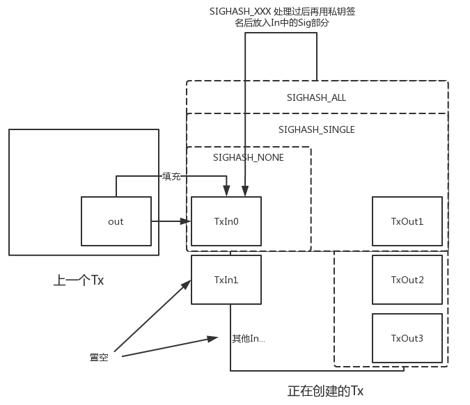

# 第6章 补充

# 签名细节

## 签名计算：

> [比特币交易签名过程详解_bebest2010的博客-CSDN博客](https://blog.csdn.net/bebest2010/article/details/81070071)

签名计算中， 把其他输入的sigscript调整为空，把自己输入的sigscript设置为pkscript,并末尾加上四字节小端序的sighash_type，并进行两次sha256：


在对这个hash进行签名计算，得出签名数据（签名时不用再计算hash，直接调用ecdsa-sign-digest）

## **脚本中的签名**

> [# bitcoin 源码解析 - 交易 Transaction(四) - Script2](https://zhuanlan.zhihu.com/p/35684664)

签名是怎么得到



如图所示，我们以图正中间的空白箭头把参与角色分为发起交易者和矿工。

这个部分也是中本聪在一开始就设计好的体系，也就是说中本聪通过hashtype字段制定了签名的对象。

```text
enum
{
    SIGHASH_ALL = 1,
    SIGHASH_NONE = 2,
    SIGHASH_SINGLE = 3,
    SIGHASH_ANYONECANPAY = 0x80,
};
```

hashtype的取值是这4个，我们由下图来解释这些取值的含义：



这里我认为中本聪设计的意图是为了通过in标明这个in控制的out的权限。我首先解释一下总体流程：

首先我们知道sig是为了填充到TxIn中的脚本的字段，而填充的这个签名所签署的东西，是**正在创建的Tx**的hash。所以很显然，我要填充的东西就是我正在创建的东西这是不可能的，所以**作为签署的临时Tx中**的txIn里面的脚本是由这个TxIn对应的上一个交易的Out中的内容来填充。生成这个临时Tx的时候是把其他的TxIn中的脚本都置空(但是保留TxIn的其他基本信息，只是把脚本置空)。这里请注意，每一个临时Tx是针对一个TxIn生成的，也就是同一个交易中的不同的TxIn完全可以用不同的hashtype来生成性质不一致的签名。而SIGHASH_XXX中的ALL，NONE，SIGNLE实际上代表的被签署的临时Tx中的TxOut的管理，一旦包含相应的TxOut进入签名的内容，就相当于签署当前TxIn的私钥的控制者对不同的TxOut的认可情况。

- SIGHASH_ALL是默认选项，具体流程是把所有的TxOut都纳入临时Tx中用来生成被签署的交易，相当于针对这个TxIn，**这个交易中的所有的TxOut都已经被这个TxIn承认，不可改**
- SIGHASH_NONE，具体流程是把所有的TxOut都置空，相当于针对这个TxIn，不关心这个交易的TxOut是什么情况，即使被替换了也是可以的
- SIGHASH_SINGLE，具体流程是只保留和自已同样index的out，其他的out都置空，表示只关心和自己同样index的out，其他的out不关心。比如当前的txin是这个交易的第3个in(index=2)，那么这个交易的第3个out保留，其他的out都置空。

而SIGHASH_ANYONECANPAY比较特殊，他是独立的。可以和另3个标志取并集。它表示签署这个TxIn的时候我连其他的TxIn都不关心，可以和前面3个并存。

```text
// Blank out other inputs completely, not recommended for open transactions
    if (nHashType & SIGHASH_ANYONECANPAY)
    {
        txTmp.vin[0] = txTmp.vin[nIn]; // 只保留自己的TxIn
        txTmp.vin.resize(1);
    }
```

而在生成这个临时Tx后，就如前面那张图的流程所示，先序列化，然后在序列化后加上hashtype(用来做校验)之后再进行hash。然后能操作对应TxOut的私钥持有者使用私钥对这个hash进行签名，签名过后附加上hashtype(告诉别人自己使用的是哪种类型)，成为放入TxIn中的sig部分数据。

另一方面对于矿工流程也就是和签名之前生成hash的流程是一致的，因为矿工可以取出签名字段末尾的hashtype明白交易的创造者使用的那种hashtype，然后进行同样的步骤生成临时交易并获得hash，然后就可以用从上一个交易中拿出来的公钥，临时交易的hash，和签名进行验证是否通过了。如验证通过，就代表这个交易中的TxIn确实是由这个私钥持有者发出了，而交易中的TxOut也确实是按照私钥持有者的意图(不同的hashtype指定的意图)生成的。

由于这样的体系，我们可以发现比特币的一个交易其实关键是交易中的TxIn，一笔交易完全可以**由不同的人**生成各自的TxIn然后再组合出这个交易，这样就让 **多方参与** 成为了可能。而不是一个交易只有输入和输出两个参与者。

同样，以上所有的设计都是在最初始版本的bitcoin中就已经完全具备的功能，再一次感慨中本聪设计比特币的细腻和高瞻远瞩。

构造交易的过程是:

1.生成临时的tx

2.然后在序列化后加上hashtype(用来做校验)之后再进行hash，这个hashtype应该交易的最后四个字节

3.签名

4.签名过后附加上hashtype(告诉别人自己使用的是哪种类型)；这个时候hashtype是作为DER-encoded signature plus嵌入到Txin里面的，Txin的最终格式是:

签名数据+1个字节的hashtype长度表示+DER encode hashtype+公钥

5.因为Txin里面有hashtype了，可以把第2步里面用到的最后四个字节删掉

6.这就是完整的一笔交易

## 参考

[Bitcoins the hard way: Using the raw Bitcoin protocol](http://www.righto.com/2014/02/bitcoins-hard-way-using-raw-bitcoin.html)

[Bitcoin mining the hard way: the algorithms, protocols, and bytes](http://www.righto.com/2014/02/bitcoin-mining-hard-way-algorithms.html)
